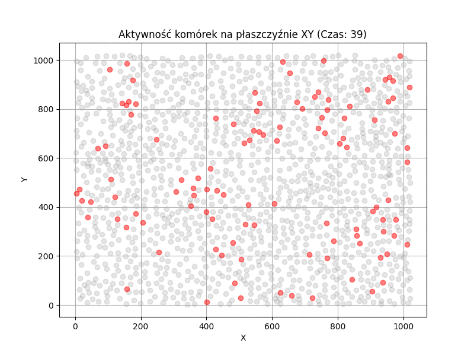

# Analiza szlaków sygnałowych AKT i ERK
Projekt ma na celu analizę aktywności szlaków sygnałowych AKT i ERK w zróżnicowanych liniach komórkowych.

## Projekt obejmuje:
- Przetwarzanie i analiza danych eksperymentalnych.
- Wizualizacje aktywności komórek w czasie i przestrzeni.
- Statystyczna analiza wyników.
- Obliczanie korelacji przestrzennych (np. przez wskaźnik Morana) w kontekście aktywności sygnalizacyjnej.

## Instalacja i uruchamianie:
- instalacja Jupyter Notebook:  
`pip install jupyter`  
 - uruchamianie Jupyter Notebook:  
`python3 jupyter notebook`

